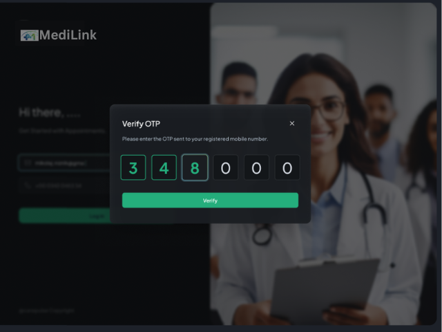
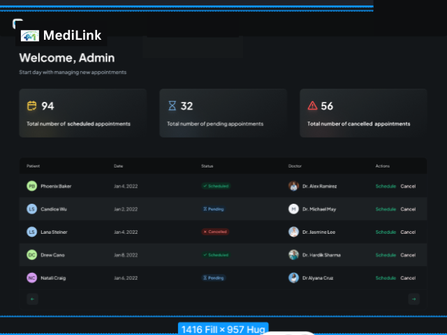
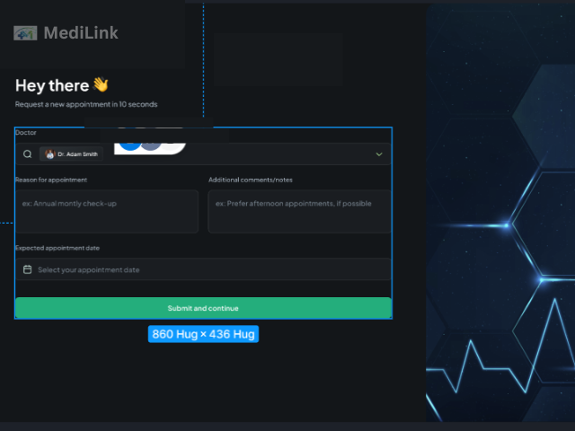
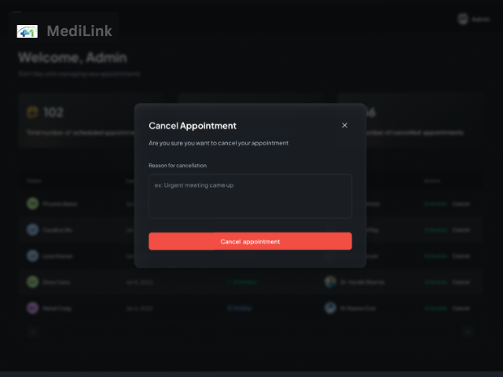
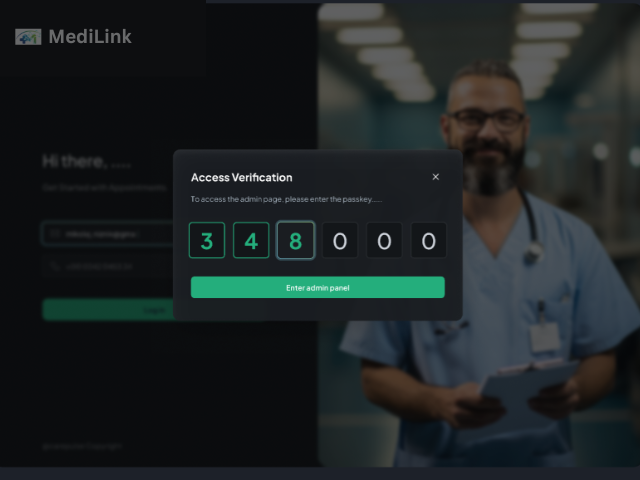
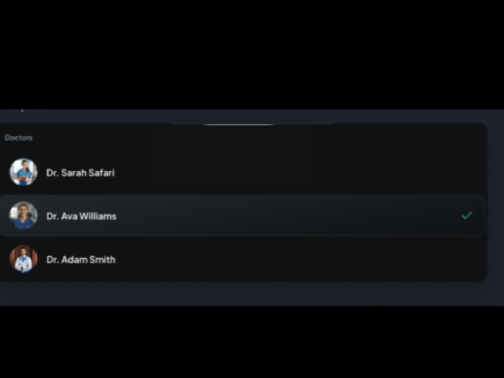

**Medilink – Patient Management System**
----
**Project Description**

Medilink is a Patient Management System designed to streamline healthcare management for clinics and hospitals. It allows patients to register, book appointments, receive real-time SMS notifications, and gives admins full control to manage doctors and appointments. The system is built with modern web technologies and focuses on usability, responsiveness, and real-time communication.

-----
**Features**

**1) User Registration & Authentication**

      * Secure patient registration and login
      * User types: Patient, Admin
      
**2)Patient Appointment Management**

      * Schedule, update, and cancel appointments
      * Real-time SMS notifications for confirmations and cancellations (via Twilio)

**3)Admin Panel**

      * Manage appointments and doctors
      * View appointment statistics (scheduled, pending, cancelled)
      * Secure passkey system for admin access     

**4)Form Handling & Validation**

      * React Hook Form + Zod for input validation
      * File uploads for identification documents
      * Dynamic and reusable form components

**5)UI & UX**

      * Responsive design with TailwindCSS
      * Dark and light mode support
      * Reusable custom components (input fields, status badges, selectors)

**6)Error Monitoring**

      * Real-time error tracking with Sentry

---
**Tech Stack**

-> **Frontend**: Next.js, TypeScript, TailwindCSS, React Hook Form, Shadcn UI

-> **Backend & Database:** Appwrite (Database, Messaging APIs)

-> **Notifications:** Twilio SMS API

-> **Monitoring:** Sentry

-> **Version Control:** Git & GitHub

----
**Folder Structure**

medilink/

  app/                     # Main application routes
  
    api/                   # API routes (server actions)
    
    admin/                 # Admin dashboard
    
    (auth)/                # Login, register
    
    (patients)/            # Patient dashboard
    
    components/            # Page-level components
    
    layout.tsx             # Root layout
    
    globals.css            # Global styles
    

  components/              # Global reusable components
  
    forms/                 # Form inputs, selectors
    
    ui/                    # Shadcn UI components
    
    dashboard/             # Dashboard widgets
    

  public/                  # Static assets
  
    assets/                # Images, icons
    
    screenshots/           # README images

  types/                   # TypeScript interfaces
    user.types.ts
    
    patient.types.ts
    
    doctor.types.ts
    
    appointment.types.ts
    

  utils/                   # Helper functions
  
    formatDate.ts
    
    generatePasskey.ts
    
    validateFields.ts
    

  lib/               # External service configs
  
    appwrite.ts
    
    twilio.ts
    
    sentry.ts

  .env.local               # Environment variables
  
  tailwind.config.js
  
  postcss.config.js
  
  tsconfig.json
  
  package.json
  
  README.md

  ----
 **Installation Guide — Medilink Healthcare System**

**✅ 1. Clone the Repository**

     git clone https://github.com/shraddha524/medilink.git
     cd medilink

     
**✅ 2. Install Dependencies***

Make sure you have Node.js 18+ installed.

**Then run:**

npm install

**✅ 3. Setup Environment Variables**

**Create a file named:**

.env.local

Add the required variables:

NEXT_PUBLIC_APPWRITE_ENDPOINT=your_appwrite_url
NEXT_PUBLIC_APPWRITE_PROJECT=your_project_id
NEXT_PUBLIC_APPWRITE_DATABASE_ID=your_database_id
NEXT_PUBLIC_APPWRITE_PATIENT_COLLECTION_ID=your_patient_collection
NEXT_PUBLIC_APPWRITE_DOCTOR_COLLECTION_ID=your_doctor_collection
NEXT_PUBLIC_APPWRITE_APPOINTMENT_COLLECTION_ID=your_appointment_collection
NEXT_PUBLIC_ADMIN_PASSKEY=your_admin_passkey

TWILIO_ACCOUNT_SID=your_twilio_sid
TWILIO_AUTH_TOKEN=your_twilio_token
TWILIO_PHONE_NUMBER=your_twilio_number

SENTRY_AUTH_TOKEN=your_sentry_auth_token

**✅ 4. Initialize TailwindCSS (if not already done)**

npx tailwindcss init -p

**✅ 5. Run the Development Server**

npm run dev

Your application will be live at:
👉 http://localhost:3000

**✅ 6. Build for Production**

npm run build

npm start

------

**Screenshots Section**

## **Screenshots**

### **Onboarding**

---

---

### **User Dashboard**

---

### **Appointment Flow**

#### Appointment Form

#### Appointment Scheduled

#### Appointment Cancel

---

### **Admin Verification**

---

### **Dropdown UI**

---

### **Success Page**

